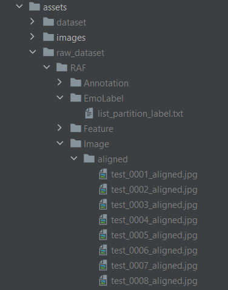

## Setup dataset:
1. Download RAF dataset (single version): http://www.whdeng.cn/raf/model1.html
2. Place files in `assets/raw_dataset/RAF/`
3. Decompress `assets/raw_dataset/RAF/image/aligned.zip`
4. Important files for us are:
   1. Labels file: `assets/raw_dataset/RAF/EmoLabel/list_partition_label.txt`
   2. Image files: `assets/raw_dataset/RAF/image/aligned/`
   
   Your file structure should be as follows:

   

## Train the models:

1. Install requirements using the `requirements.txt` file (we recommend using a virtual environment).
2. Execute the `main.py` file. Results will be generated in `results/`.

**Note:** If you want to train using GPU (way faster) follow the following links for Windows. Instructions should be similar for other OSs:
1. https://medium.com/@ashkan.abbasi/quick-guide-for-installing-python-tensorflow-and-pycharm-on-windows-ed99ddd9598
2. https://discuss.tensorflow.org/t/tensorflow-gpu-not-working-on-windows/13120/3